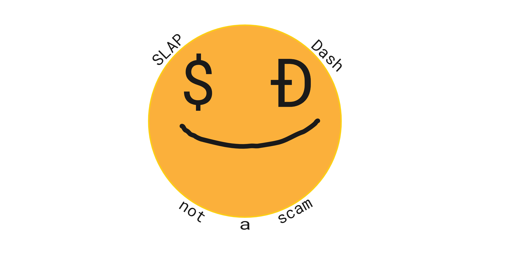

# SlapDash

## "One coin to rule them all!"

SlapDash is an RNG based cryptocurenncy, the block mining reward is completely ranodom, you could recive 1 - 100,000.00 SlapDash Coins as a block reward.
You can find the 100% open-source code for this project by going to the [/slapdash](https://github.com/limiteci/SlapDash/tree/main/SlapDash) folder in this repository.

### Licence Information

 You are free to edit this software in any way you would like to. If you need further information on the lince of this repository you can find that information in the [/license](https://github.com/limiteci/SlapDash/blob/main/LICENSE) folder.

### Usage

This coin is open-source and available to utilize in any way that you see fit. The included wallet application can be used to send/receive SlapDash currency and the application itself is your own. If you are interested in mining SlapDash crypto there is an included python based mining application in the repository along with instructions on how to run it. SlapDash is a currency tool that has not yet been implemented into any known cryptocurrency exchanges so as of right now the easiest way to accumulate SlapDash is by mining. SlapDash is a **scrypt** based cryptocurrency unlike the SHA256 blockchain that the **Bitcoin Network** runs off of.

